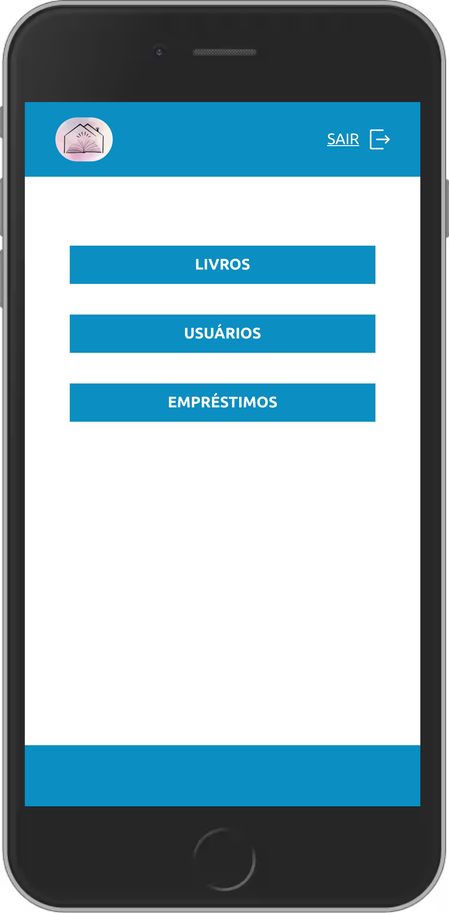
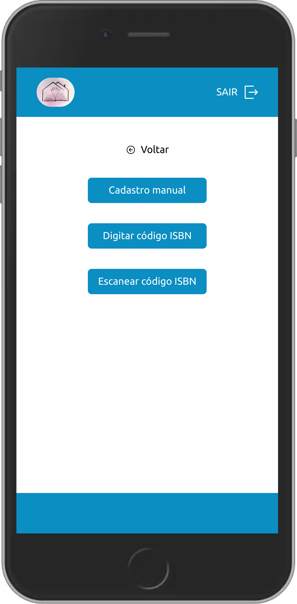
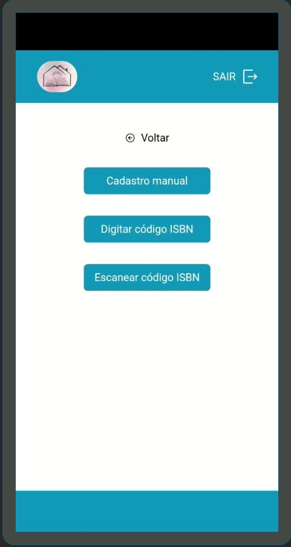

# cceak-books
> 🇺🇸 Documentation in English

> 📚 Books from the Casa de Cultura Espirita Allan Kardec

🇧🇷 [Documentation in Portuguese](./docs/README_PT_BR.md)

🇧🇷 [Manual in Portuguese](./docs/MANUAL_PT_BR.md)


## Overview

CCEAK Books is a simple application for registering and managing books, users and book loans.

This application uses Google sheets as a database.

📡 APIs used to search the books
- Google API: https://www.googleapis.com
- Brazil API: https://brasilapi.com.br

## ✨ Features
- 📚 Register books manually by filling out a form, the cover can be photographed using the feature available in one of the form fields.

- 📚 Registration of books by searching by ISBN code, after the search returns an expected result, you can register the found book.

- 📚 Book registration by scanning the ISBN code, after the search returns an expected result, you can register the found book.

- 🙅 User registration

- 🎁 Loan registration


## Requirements

<a href="./docs/sheets_template.xlsx" download>
    Sheet template
</a>

1. Create a spreadsheet with the same structure as
2. Share the spreadsheet with a public link
3. Create an account at https://sheet.best/
4. Create a new connection
5. In this new connection, add the spreadsheet link
6. After creating the connection, a connection URL will be generated something like this https://sheet.best/api/sheets/00aaaa00-0aa0-0aa0-aaa0-00aa00a0a00a
7. Only copy the code at the end of the URL 00aaaa00-0aa0-0aa0-aaa0-00aa00a0a00a
8. Rename the `env.template` file to `.env`
9. In the `.env` file add the code copied to the environment variable `NEXT_PUBLIC_SHEET_KEY=00aaaa00-0aa0-0aa0-aaa0-00aa00a0a00a`


## 🚀 Running development mode
```bash
yarn dev
```
🚀 The application will be running at http://localhost:3000

## 👷 Build
```bash
yarn build
```

## 👌 Running lint
```bash
yarn lint
```

> Below are some screenshots on a mobile device.

<table>
    <thead></thead>
    <tbody>
        <tr>
            <td>
                
            </td>
            <td>
                
            </td>
        </tr>
        <tr>
            <td>
                
            </td>
            <td>
                
            </td>
        </tr>
        <tr>
            <td>
                
            </td>
            <td>
                
            </td>
            </tr>
        </td>
        <td>
             <td>
                
            </td>
        </tr>
    </tbody>
</table>
