# Manual

> Aplicação: cceak-books
>
> versão: 1.0.0

<ol>
    <li>
        <a href="#livros">Cadastrando, editando e removendo livros</a>
        <ul>
            <li>
                <a href="#cadastro-de-livros-manualmente">1.1 Cadastro de livros manualmente</a>
            </li>
            <li>
                <a href="#cadastro-de-livros-digitando-codido-isbn">1.2 Cadastro de livros digitando códido ISBN</a>
            </li>
            <li>
                <a href="#cadastro-de-livros-escaneando-codigo-isbn">1.3 Cadastro de livros escaneando código ISBN</a>
            </li>
        </ul>
    </li>
     
    <li>
        <a href="#usuarios">Cadastrando, editando e removendo usuários</a>
        <ul>
            <li>
                <a href="#cadastro-de-usuario">2.1 Cadastro de usuário</a>
            </li>
            <li>
                <a href="#edicao-de-usuario">2.2 Edição de usuário</a>
            </li>
            <li>
                <a href="#exclusao-de-usuario">2.3 Exclusão de usuário</a>
            </li>
        </ul>
    </li>
     
    <li>
        <a href="#emprestimos">Cadastrando e removendo empréstimos</a>
        <ul>
            <li>
                <a href="#registrar-um-emprestimo">3.1 Registrar um empréstimo</a>
            </li>
            <li>
                <a href="#visualizando-um-emprestimo">3.2 Visualizar um empréstimo</a>
            </li>
            <li>
                <a href="#removendo-um-emprestimo">3.3 Removendo um empréstimo</a>
            </li>
        </ul>
    </li>
</ol>

 
<h2 id="livros">Livros</h2>

> Cadastrando, editando e removendo livros

<h3 id="cadastro-de-livros-manualmente">Cadastro de livros manualmente</h3>

Na tela inicial, clique no botão "`Administração`" no canto superior direito.

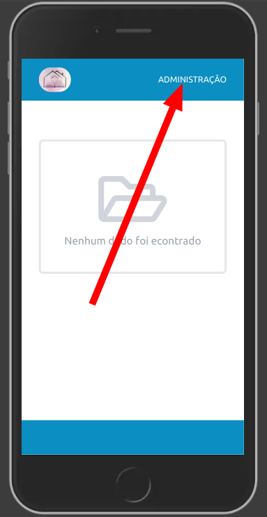

Em seguida clique no botão "`Livros`"

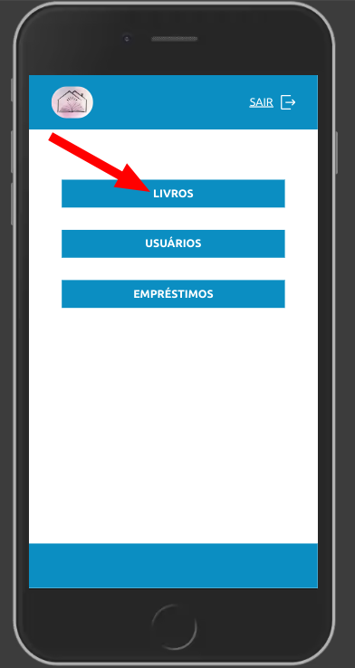

Agora clique no botão "`Cadastrar Livro`"

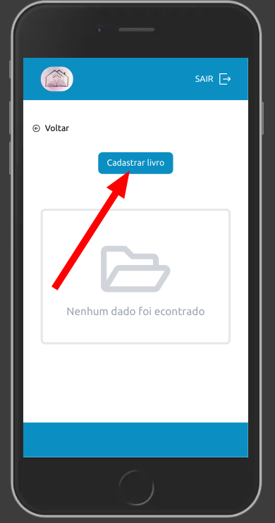

Clique no botão "`Cadastro manual`"

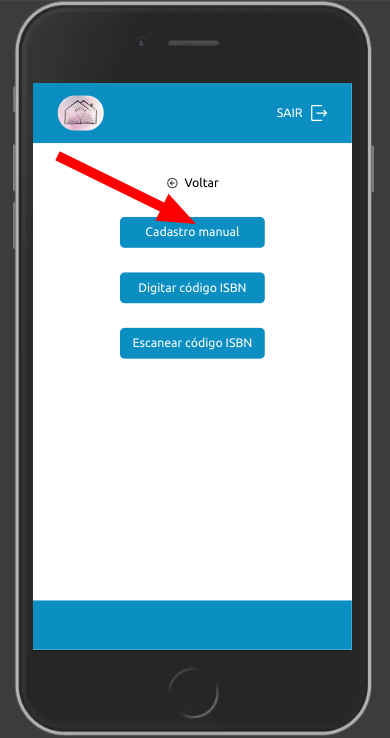

Preencha o formulário e clique no botão "`Cadastrar`" que está no final da tela

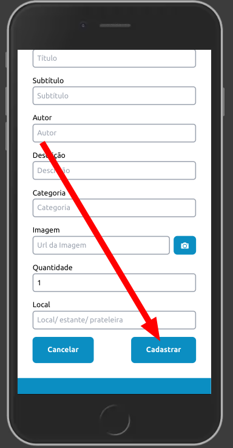

<h3 id="cadastro-de-livros-digitando-codido-isbn">Cadastro de livros digitando códido ISBN</h3>

Na tela inicial, clique no botão "`Administração`" no canto superior direito.

Em seguida clique no botão "`Livros`"

Agora clique no botão "`Cadastrar Livro`"

Clique no botão "`Digitar código ISBN`"

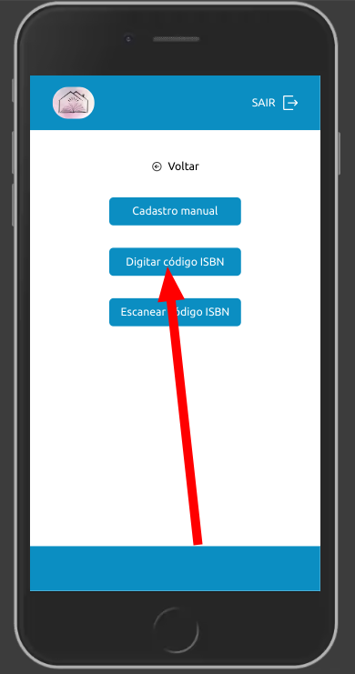

Digite o código ISBN e clique em pesquisar

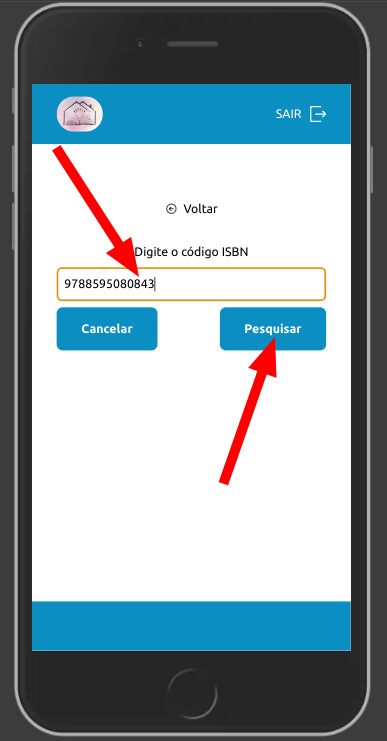

Verifique se o resultado está correto 

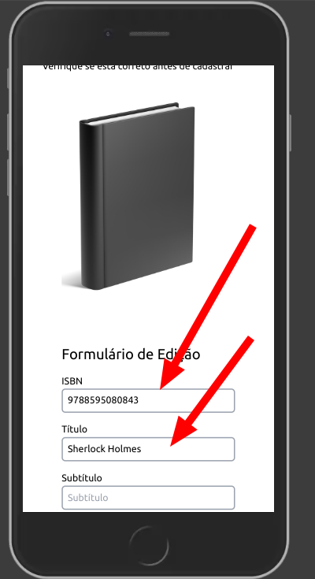

Clique no botão "`Cadastrar`" que está no final da tela

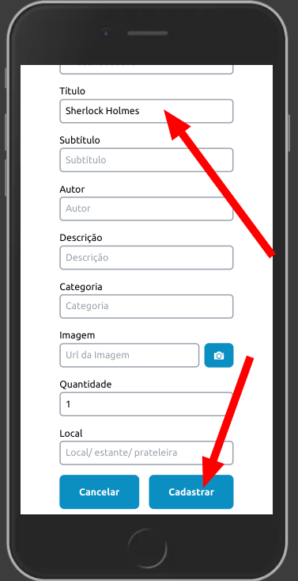

<h3 id="cadastro-de-livros-escaneando-codigo-isbn">Cadastro de livros escaneando código ISBN</h3>

Na tela inicial, clique no botão "`Administração`" no canto superior direito.

Em seguida clique no botão "`Livros`"

Agora clique no botão "`Cadastrar Livro`"

Clique no botão "`Escanear código ISBN`"

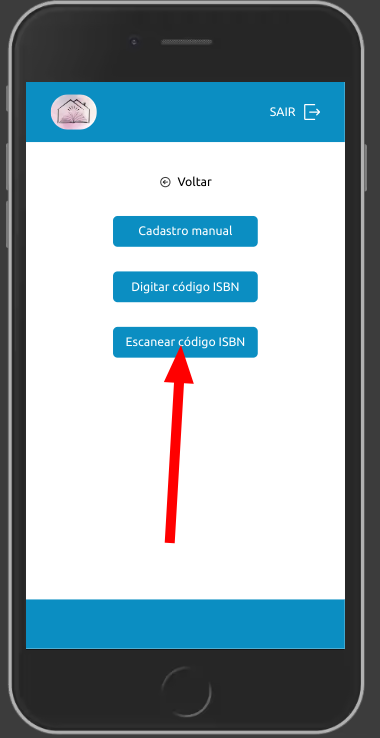

Se for o primeiro acesso, será necessário clicar no botão "`Request Camera Permissions`" para dar acesso a camera do dispositivo

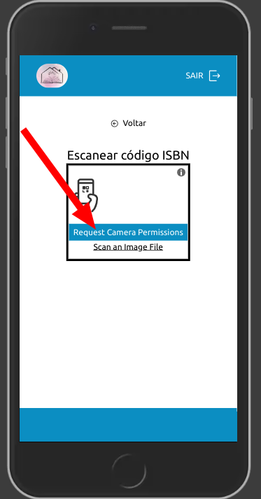

Vai aparecer um "popup", clique em permitir

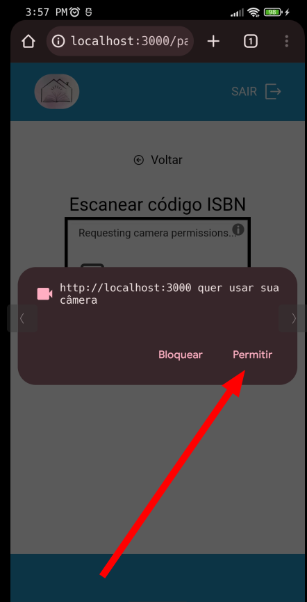

Selecione a camera

Obs.: No celular é indicado a camera traseira(facing back)

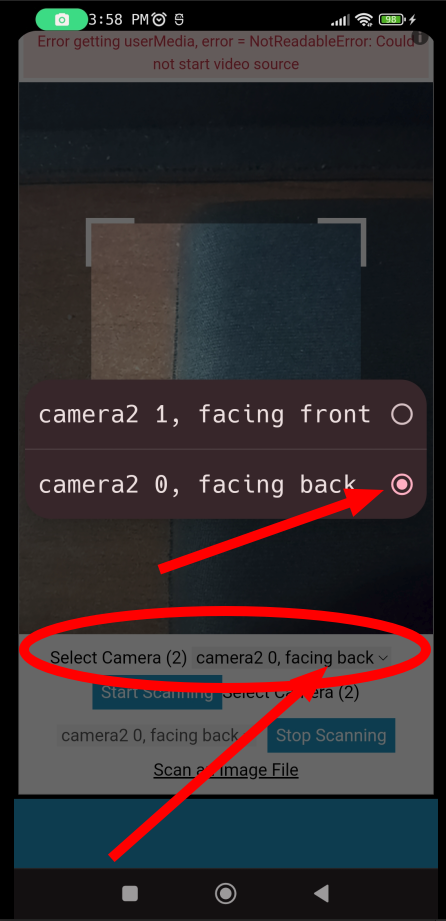

Após escanerar o código, clique em pesquisar

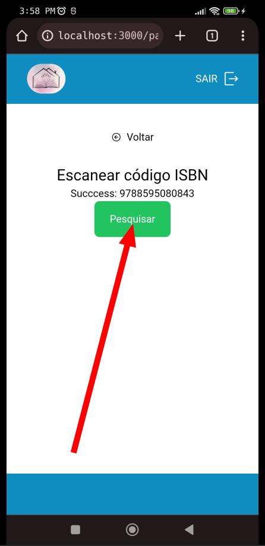

Verifique se o resultado está correto 

Clique no botão "`Cadastrar`" que está no final da tela

 
<h2 id="usuarios">Usuários</h2>

> Cadastrando, editando e removendo usuários

<h3 id="cadastro-de-usuario">Cadastro de usuário</h3>

Na tela inicial, clique no botão "`Administração`" no canto superior direito.

Clique no botão "`Usuários`"

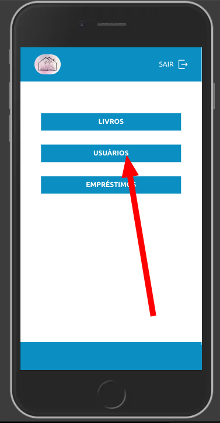

Clique no botão "`Cadastrar usuário`"

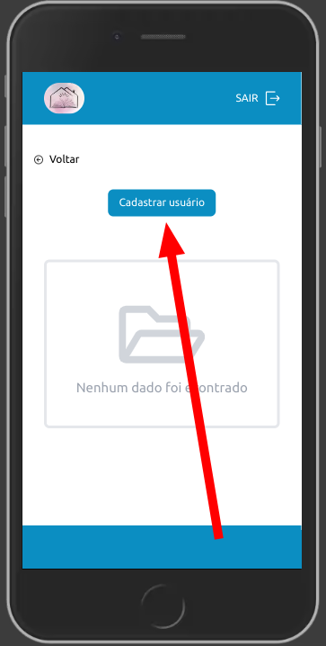

Preencha os campos e clique no botão "`Cadastrar`"

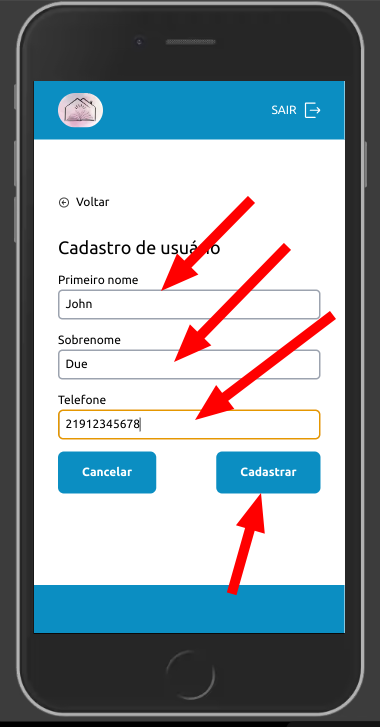

 

<h3 id="edicao-de-usuario">Edição de usuário</h3>

Na tela inicial, clique no botão "`Administração`" no canto superior direito.

Clique no botão "`Usuários`"

Na lista de usuários, clique no ícode de "`Lápis`"

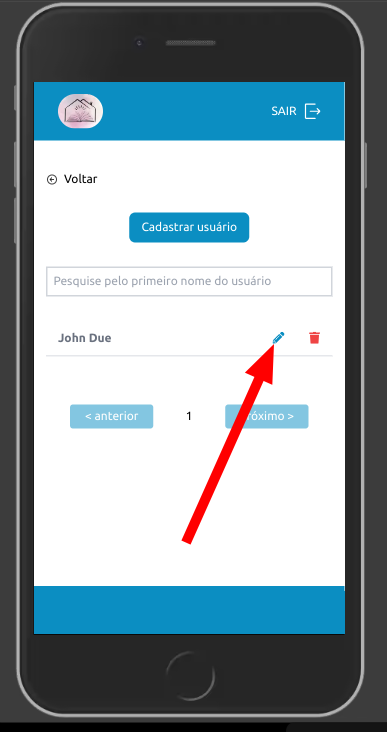

Edite os campos e depois clique em salvar

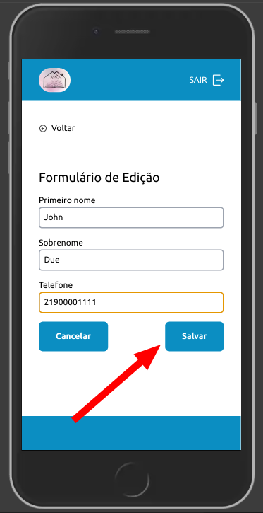

 

<h3 id="exclusao-de-usuario">Exclusão de usuário</h3>

Na tela inicial, clique no botão "`Administração`" no canto superior direito.

Clique no botão "`Usuários`"

Na lista de usuários clique no ícone de "`Lixeira`"

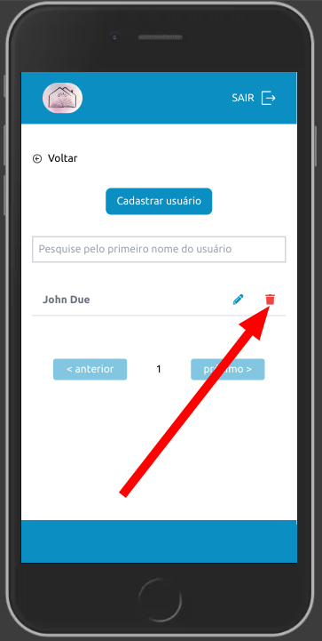

 
<h2 id="emprestimos">Empréstimos</h2>

> Cadastrando e removendo empréstimos

<h3 id="registrar-um-emprestimo">Registrar um empréstimo</h3>
Quando há livros cadastrados e não estão emprestados, podemos ver na parte inferior de cada Livro o status em cor verde escrito "disponível"

Obs.: Para devolver um livro, ou  desfazer um empréstimo, basta excluir o empréstimo.

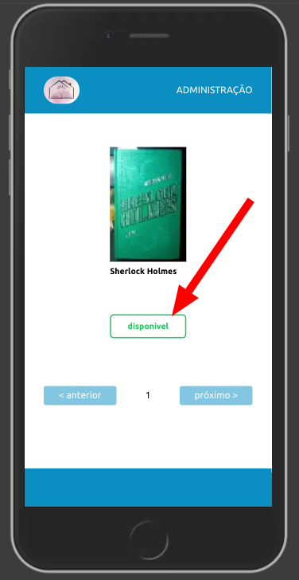

Agora , vamos realizar um empréstimo.
Na tela inicial, clique no botão "`Administração`" no canto superior direito.

Clique no botão "`Empréstimos`"

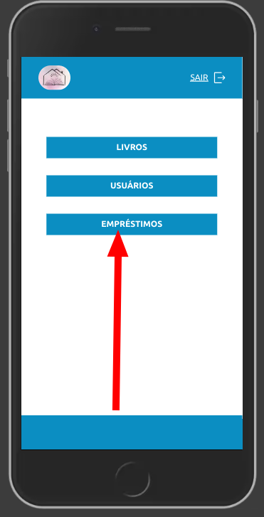

Clique no botão "`Registrar um Empréstimo`"

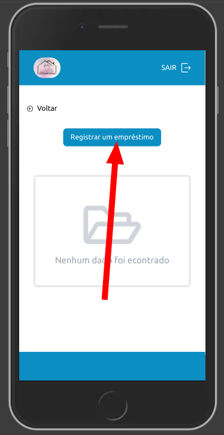

Procure pelo usuário que deseja emprestar, e clique no ícone do "`Lápis`"

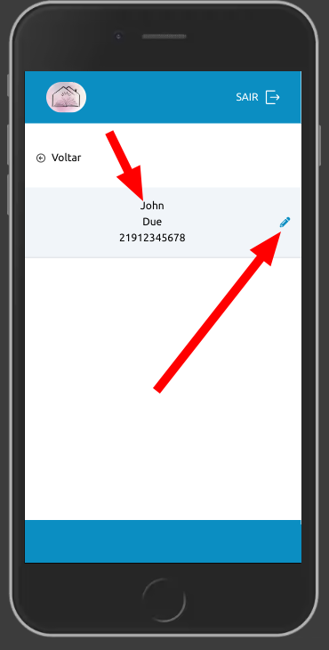

Agora nesta tela tem um campo para buscar o livro que deseja emprestar ao este usuário.

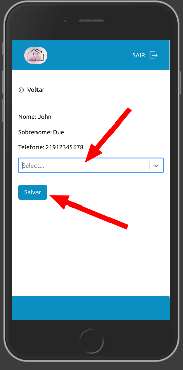

Ao digitar o nome irá aparecer em uma lista, selecione o nome do livro e clique em salvar

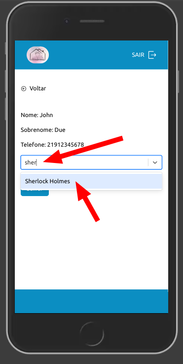

Voltando a tela inicial, veremos que agora o `status` do livro mudou de `disponível` para `emprestado`

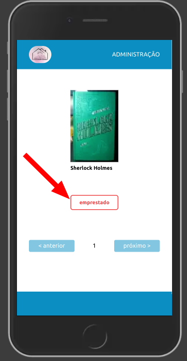

<h3 id="visualizando-um-emprestimo">Visualizando um empréstimo</h3>

Acesse a área de administração -> clique no botão empréstimos -> clique no `ícone de lupa`

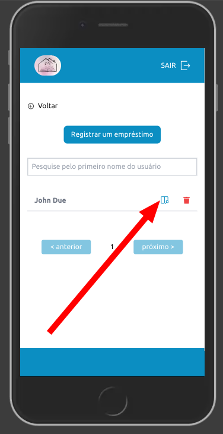

<h3 id="removendo-um-emprestimo">Removendo um empréstimo</h3>

1°. forma:
Acesse a área de administração -> clique no botão empréstimos -> clique no `ícone de lixeira`

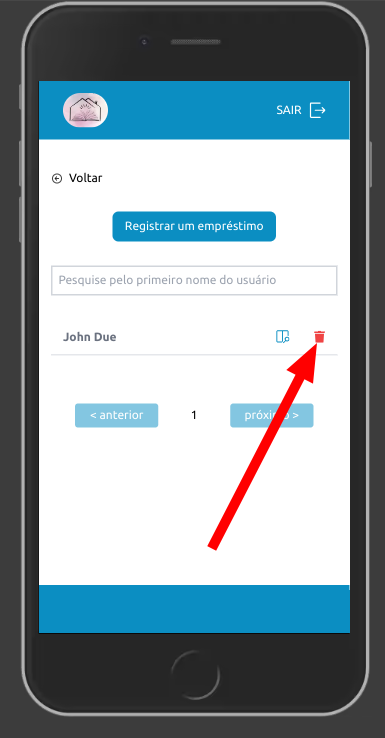

2°. forma
Acesse a área de administração -> clique no botão empréstimos -> clique no `ícone de lupa`

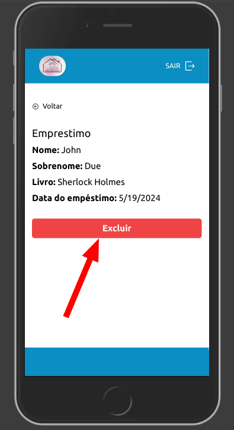
