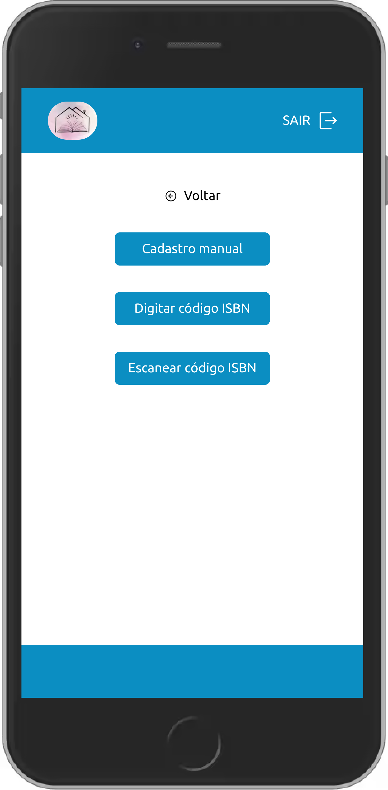
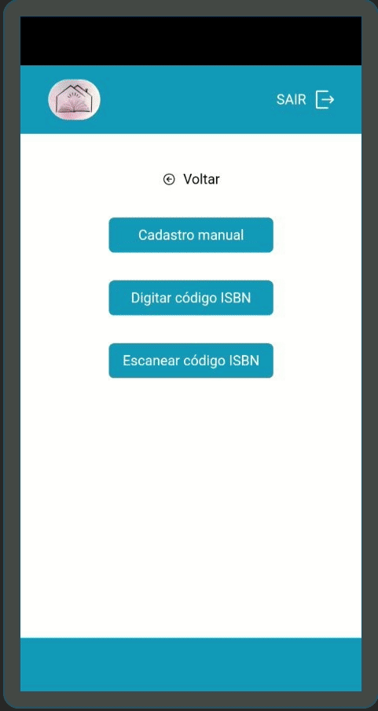

# cceak-books 
> 🇧🇷 Portuguese 

> 📚 Livros da Casa de Cultura Espirita Allan Kardec

🇧🇷 [Manual em Português](./MANUAL_PT_BR.md)

## Visão geral 

CCEAK Books é uma aplicação simples para cadastrar e gerenciar livros, usuários e empréstimos de livros.

Esta aplicação usa as planilhas do Google(Google sheets) como banco de dados.

📡 APIs usadas para pesquisar os livros
- Google API: https://www.googleapis.com
- Brazil API: https://brasilapi.com.br

## ✨ Funcionalidades
- 📚 Cadastro de livros manualmente preenchendo um formulário, a capa pode ser fotografada usando o recurso disponível em um dos campos do formulário.

- 📚 Cadastro de livros pesquisando por código ISBN, após a busca retornar um resultado esperado pode-se cadastrar o livro encotrado.

- 📚 Cadastro de livros escaneando o código ISBN, após a busca retornar um resultado esperado pode-se cadastrar o livro encotrado.

- 🙅 Cadastro de usuários

- 🎁 Cadastro de empréstimos


## Requisitos

<a href="./sheets_template.xlsx" download>
    Sheet template
</a>
    
1. Criar planilha com a mesma estrutura do 
2. Compartilhar a planilha com link público
3. Cria conta no https://sheet.best/
4. Crie um nova conexão
5. Nesta nova conexão, adicione o link da planilha
6. Após criar a conexão, vai ser gerado uma URL de conexão mas ou menos assim https://sheet.best/api/sheets/00aaaa00-0aa0-0aa0-aaa0-00aa00a0a00a
7. Copie apenas o código do final da URL 00aaaa00-0aa0-0aa0-aaa0-00aa00a0a00a
8. Renomeie o arquivo `env.template` para `.env`
9. No arquivo `.env` adicione o código copiado à variável de ambiente `NEXT_PUBLIC_SHEET_KEY=00aaaa00-0aa0-0aa0-aaa0-00aa00a0a00a`


## 🚀 Rodando o mode de desenvolvimento
```bash
yarn dev
```
🚀 A aplicação vai estar rodando em http://localhost:3000

## 👷 Build
```bash
yarn build
```

## 👌 Rodando lint
```bash
yarn lint
```

> A seguir alguns capturas de telas em um dispositivo móvel.

<table>
    <thead></thead>
    <tbody>
        <tr>
            <td>
                
            </td>
            <td>
                
            </td>
        </tr>
        <tr>
            <td>
                
            </td>
            <td>
                
            </td>
        </tr>
        <tr>
            <td>
                
            </td>
            <td>
                
            </td>
            </tr>
        </td>
        <td>
             <td>
                
            </td>
        </tr>
    </tbody>
</table>